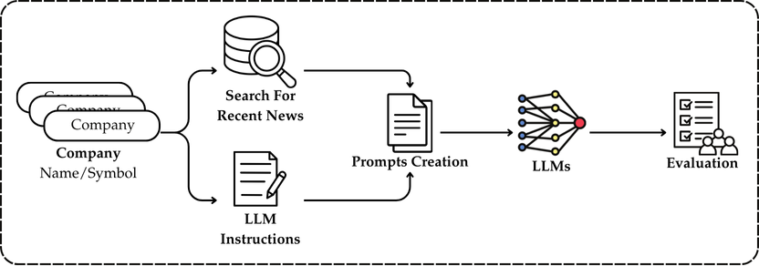

# LLM 4 Stock Prediction 📈🤖



**LLM 4 Stock Prediction** is the research code‑base that accompanies the paper  
*“Can LLMs Predict the Stock Market? A Comparative Analysis on the NIFTY 50”* (2025).

The repository demonstrates how four large‑language models—**ChatGPT‑o3 Mini**, **SUTRA‑light**, **Gemini 2.0 Flash**, and **Grok 2**—were prompted on 12 April 2025 with fresh Google‑News headlines and then benchmarked against the first trading session that followed (15 April 2025).  
All charts, CSV/XLSX outputs, and evaluation tables found in the paper are produced directly from this code.

---

## 📂 Repository layout

```
LLM4StockPrediction/
├── data/          # Raw & processed CSV/XLSX generated by the notebook
├── fig/           # All figures used in the paper (line charts, workflow, etc.)
├── utils.py       # Helper functions for news collection & prompt generation
├── main.ipynb     # End‑to‑end experiment: fetch news → prompt LLMs → evaluate
└── requirements.txt
```

---

## 🛠️ Key modules

| File / object | Purpose |
|---------------|---------|
| **`utils.py`** | |
| `fetch_news(query, experiment)` | Scrapes the latest Google‑News headlines for a given company using Selenium + BeautifulSoup and returns a list of article snippets. |
| `create_prompt_1(query, news)` | Builds the *baseline prompt* used in the published study (no persona, ten headlines, zero‑shot). |
| `create_prompt_2…create_prompt_6` | Placeholder generators for richer prompts (e.g.\ including last‑price context, chain‑of‑thought, multilingual variants). Not used in the current paper but stubbed for future work. |
| **`main.ipynb`** | Notebook that orchestrates the full pipeline: load NIFTY 50 tickers → fetch news → build prompts → query each LLM via API → map raw responses to ratings → evaluate vs actual market move → save datasets → plot figures. |

---

## 🚀 Quick start

```bash
# 1. Clone repo
git clone https://github.com/SAGAR-TAMANG/LLM4StockPrediction.git
cd LLM4StockPrediction

# 2. (Optional) create virtual environment
python -m venv .venv && source .venv/bin/activate

# 3. Install dependencies
pip install -r requirements.txt

# 4. Launch Jupyter and run the experiment
jupyter lab main.ipynb
```

> **Note:**  
> You’ll need valid API keys for each LLM provider and a local Chrome/Chromedriver
> install for Selenium. Update paths & keys in the first config cell of
> `main.ipynb`.

---

## 📊 Reproducing the paper

Running every cell in `main.ipynb` will:

1. **Scrape** the ten most recent headlines per NIFTY 50 company (as of the run date).  
2. **Prompt** the four LLMs with those headlines via `create_prompt_1`.  
3. **Generate** rating predictions in the set \\(\{-2,-1,0,1,2\}\\).  
4. **Compare** predictions to the actual intraday percentage change between 09:30 and 15:30 on the next trading session, binning returns into the same five‑point scale.  
5. **Save** intermediate CSV/XLSX to `data/` and export all figures to `fig/`.  
6. **Print** exact‑match and directional‑accuracy metrics identical to Tables 3 & 4 in the manuscript.

---

## 🗺️ Road‑map

* Add `create_prompt_2 … 6` variants:  
  * price‑anchored prompts  
  * chain‑of‑thought / tree‑of‑thought  
  * multilingual sentiment fusion  
* Extend horizon analysis (1 day → 5 days) and rolling back‑tests.  
* Fine‑tune a finance‑specific LLM and benchmark against foundation models.  
* Integrate technical indicators and macro variables for hybrid scoring.

---

## 📖 Citation

If you find this code useful, please cite the companion paper:

```bibtex
@misc{tamang2025llm4stock,
  title        = {Can LLMs Predict the Stock Market? A Comparative Analysis on the NIFTY 50},
  author       = {Tamang, Sagar and Das, Upasana and Modi, Kritika and Sharma, Keshav and Bora, Dibya Jyoti},
  year         = {2025},
  note         = {Working paper, arXiv pre‑print forthcoming},
  howpublished = {\\url{https://github.com/SAGAR-TAMANG/LLM4StockPrediction}}
}
```

---

## 📜 License

This project is released under the **MIT License**—see [`LICENSE`](LICENSE) for details.

Happy experimenting, and feel free to open issues or PRs!